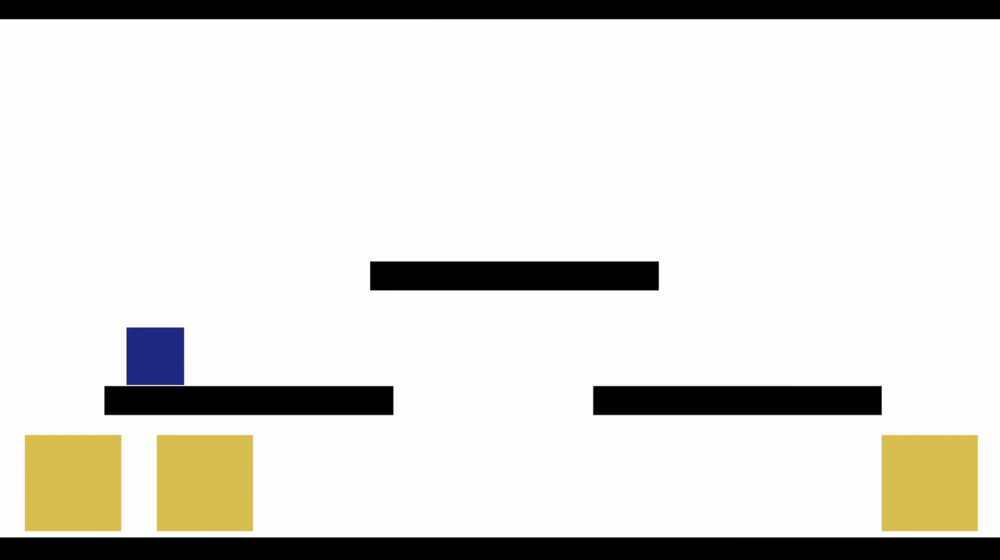

# APPROACH

Total time in development : (to be calculated)

---
## Session 001
### 240 mins
Done
- Made a tiny, messy, not-fun-to-play mvp

V1:

I didn't really like this movement, and the format won't really fit the art that I'm envisioning.

V2:

A top down view with a free-roaming player will work much better I think, and a joystick suits that better than buttons. The world will be as if looking through a microscope, so I think a bit of float on the character controller will be good.

V3:

Added hazards

V4:

Added collectibles and a timer

V5:

Added the core mechanic besides movement: transfer of energy. Touching and holding a hazard will move 'mana' from the player to the hazard, until it becomes friendly. If the player runs out of mana, it dies.

V6:

Added moving hazards with various mana needs and drops. Converting hazards to friendlies will make more mana available to the player, and allow progress through the levels.

---

## Session 002
### 85 mins

TO DO
- video/gif pipeline (windows capture - blender - screentogif?)

DONE 
- Started a Trello board to organise production and marketing https://trello.com/b/LU8EUwUU/tardigradeofmana
- Video + GIF pipeline, just ScreenToGif for both!
- Added gifs and notes to session 001 above.

---

## Session 003
### 35 mins

TODO
- untrack mp4s
- round placeholder art (concave + convex)

DONE
- untrack mp4s
- round placeholder art (concave + convex)
- Make and untrack a Production folder for working files

---

## Session 004
### 30 mins

TODO
- Triangle placeholders
- Refactor
    - Delete unused scripts
    - Encapsulate data
    - Make GameManager accessible to all
    - Remove unused joystick assets + scripts

DONE
- Triangle placeholder art
- Removed unused joystick assets + scripts
- Deleted unused scripts and scenes

---

## Session 005
### 125 mins

TODO:
- Make ring placeholder sprites
- Encapsulate data
- Make GameManager accessible to all

DONE
- Make ring placeholder sprites
- Getter and setters for GameManager variables
- Removed getters and setters, overcomplicating
- Set up simple hazard
- Set up mana collectible
- Tried to push to phone, failed
- Reimported joystick pack and put files back where they were
- Pushed to phone

---

## Session 006
### 70 mins

TODO
- Add agent to scene
- Refactor mana receiver
- Refactor mana giver

DONE
- Add agent to scene
- Make agent mana text
- Set hazard damage and agent manaMax
- Added a delay of a second when winning
- Added multitouch back to joystick script
- Pushed to phone

---

## Session 007
### 60 mins

TODO
- README
- Make camera prefab

DONE
- Camera prefab
- Described idea in readme

---

## Session 008
### 30 mins

TODO
- User stories
- Tech stack notes
- Demo level design documents

DONE
- User stories
- Tech stack notes
- Noted the general beats for tutorial/demo level

---

## Session 009
### 35 mins

TODO
- Sketch demo map and annotate

DONE
- Sketched some scene layouts, focusing on introducing mechanics

## Session 010
### 30 mins

TODO
- Finish sketching demo level scenes
- Start building demo scenes

DONE
- Simple layout sketched

- Started a scene with a drawn wall

## Session 011
### 75 mins

TODO
- Add door collider and script to fade and load

DONE
- Add door object and collider
- Add script to load scene
- add fade animations
- made gamemanager a singleton so scripts can access it without a reference
- door triggers fadeout

---

## Session 012
### 50 mins

TODO
- Swap to singleton access instead of manager refs
- Refactor
- Make second demo scene

DONE
- Read about events, decided to stick with singleton
- Moved some logic from Door and Player to GameManager
- Made second scene

---

## Session 013
### 60 mins

TODO
- Make scene 3

DONE
- Draw map
- Added doors
- Add spinner hazards with animation
- Changed which scene dead scene loads
- Built to phone, fade animations not working
- Tried changing colour, no change
- Made a test raw image, shows
- Raw image with animator not working
- Remade gobo object with rawimage and animator, working on device
- Fixed animations and stopped being raycast target

---

## Session 014
### 110 minutes

TODO
- Persist game manager as proper singleton created in any level
- make gamemanager find levelmanager (non-persistent)

DONE
- Made gamemanager a proper persistent singleton
- Added a LevelManager to each scene
- gamemanager finds levelmanager if one in scene, using a listener on scenemanager
- made levelmanager static, point doors to that instead of gamemanager
- commented out gamemanager logic for finding levelManager, incase needed for later
- made level 3 finish load win screen

---

## Session 015
### 90 mins

TODO
- Make dead reload current scene
- Make scenes reload at correct door

DONE
- Moved some logic from game to level managers
- Dead loads scene died on
- Added spawn points array to level manager
- Added spawn from string array to level manager
- Set player to spawn at door from previous level
- Snap camera at scene start
- Snap camera not working on level 2
- Snap camera not working at all on android
- Moved camera snap call to levelmanager, works

---

## Session 016
### 65 mins

TODO
- Reload at correct spawnpoint if died
- Persist player state
- Add take damage animation to player

DONE
- Spawn point persists if died
- Damage animation
- Player mana written to playerprefs at level exit and loaded on level enter
- Bug

---

## Session 017
### 80 mins

TODO
- Hunt the bug
- Level 4

DONE
- Bug was saying there was no text object but there was. Removed and readded and it works again
- Player pref not working on device
- Installed logcat package to track log
- Log show mana is being written to
- Level 3 only shows correct mana
- Some scenes had multiple payler scripts for an unknown reason 
- Joystick not working on level 2
- Joystick wasn't set in editor
- Reset player mana at level 1

---

## Session 018
### 65 mins

TODO
- Level 4
    - Draw map
    - Make scene
    - Add fountain
    - Add NPC (guide)
    - Add dialogue system

DONE
- Level 4 map
- Scene connected to others
- Added fountain with emitter that shoots collectible particles in random direction
- Particles have their state set by fountain
- Particles self destruct

---

## Session 019
### 50 mins

TODO
- Add NPC (guide)
- Add dialogue system

DONE
- Added a TMPro ui element that is written to at start
- Added typewriter effect
- Added box image behind text

---

## Session 020
### 145 mins

TODO
- Dialogue from characters

DONE
- Added a scriptableobject for dialogue which can be created from the menu, and a datadialogue folder
- Dialogues are scrolled through and then the dialoguebox is closed
- Dialogues are scrolled through when tapped on instead of with spacebar
- Made a dialogue trigger area
- Made collectibles only collectible by player
- Player triggers dialogue
- Stopped dialogue box retriggering if active
- Fountain working on phone but dialogue getting not set to reference error
- Dialogue worked for a minute then stopped
- Doors on level 4 not working anymore
- Assigned references in editor rather than using getcomponent, works on phone too
- Changed canvas scaler options

---

## Session 021
### 30 mins

TODO
- Player flash when receiving mana
- Add guide npc to revive on level 4

DONE
- Made a healed animation
- Made a Healed method on player that updates mana and triggers animation
- Drawn a new map for level 4

---

## Session 022
### 60 mins

TODO
- Add guide npc to revive
- Add barrier
- Hide life counter until finding first fountain

DONE
- NPC guide receives mana
- guide location has dialogue
- added barrier
- added a wall to remove after guide is helped
- added dialogue conditions script with method overloading for player/int

---

## Session 023
### 160 mins

TODO
- Add story beat switch statement with level specifics
- Turn dialogue trigger off after reviving guide
- Turn barrier off after reviving guide
- Have guide follow player after being revived
- Hide mana counter until finding first fountain
- Stop player receving mana if at max

DONE
- Removed dialogue conditionals
- Made a currentStoryBeat int on levelmanager
- dialoguetrigger refers to currentStoryBeat when choosing dialogue to display
- Made a storyBeatTrigger script to put on relevant object
- Switch statement on storyBeatTrigger that takes the current scene name
- nested switch statement for each scene that takes currentStoryBeat
- realised storytrigger has too many conditions, changing to individual scripts for each scene and beat

---

## Session 024
### 80 mins

TODO
- Insert events and listeners to progress story beats
    - Player gets max health
    - Guide gets max health
    - Last guide dialogue finished
- Persist story state between levels

DONE
- Collectibles not collected if player is at max mana
- Event and listener added for when player is at max
- Dialogue closes if player leaves trigger
- Calling dialogue box resets it before displaying
- Player mana text resets properly
- Story beat saved to prefs per level
- half a second wait after typewriter effect finishes
- Reset story state at awake
- sped up stypewriter
- end of dialogue triggers event

---

## Session 24
### 60 mins

TODO
- Persist story state between levels
- Have guide follow player after being revived
- Turn barrier off after reviving guide

DONE
- Made a transform orbiting the player
- Set orbiter animation layer weight
- Realigned fountain emitter
- Levelmanager story beat enables guide
- Guide moves towards orbiter
- Guide moves smoothly to orbiter

---

## Session 25
###  60 mins

TODO
- Refactor

DONE
- Modelling the classes for refactor

---

## Session 026
### 35 mins

TODO
- Test current build on phone
- Continue modelling the classes and control flow
- Persist story state between levels
- Turn barrier off after reviving guide

DONE
- found Guide moves very slowly on android
- Guide speed in android matches editor
- found index array error for dialogue
- removed unnecessary argument in dialogue method
- added a try catch block for dialogue triggering

---

## Session 027
### 55 mins

TODO
- Implement level events interface on individual scripts per level
- Continue modelling the classes and control flow
- Persist story state between levels
- Turn barrier off after reviving guide

DONE
- Continue modelling the classes and control flow

---

## Session 028
### 120 mins

TODO
- Refactor mana
- Create an agent class for mana holders to inherit from and have methods triggered by mana changes

DONE
- Created a mana script with properly accessed variables
- Agent class inheriting from monobehaviour
- playeragent class inheriting from agent
- mana component looks for agent component on object
- mana component throws exception if no agent component found
- agent component looks for mana component on object
- agent component throws exception if no agent component found
- playeragent calls base start method before it's own
- player agent gets animator component, throws exception if it can't find one
- playeragent triggers heal/damage animations

---

## Session 29
### 85 mins

TODO

- Merge the mana and mana agent classes, inherit agents from it
- Continue modelling the classes and control flow
- Persist story state between levels
- Turn barrier off after reviving guide

DONE

- Continue modelling the classes

- Merge the mana and mana agent classes, inherit agents from it
- Collectibles work with player agent
- Hazards work with player agent
- Made manual getters and setters for mana
- manual getter for max mana (auto get/set was returning wrong value)
- protected methods

---

## Session 030
### 75 mins

TODO
- Refactor the mana exchange mechanic
- Continue modelling the classes and control flow

DONE
- Refactored mana exchange mechanic using manaagents
- Edited demo level and level manager script to test refactor so far on android
- Single test level works as expected on android

---

## Session 031
##  100 mins

TODO
- UI and canvas fades
- Move dialogue behaviour to canvas manager
- Level manager story event announcements

DONE
- Canvas triggers it's own fade in on each level so far
- Level manager triggers canves fade out
- Move dialogue behaviour to canvas manager
- Dialogue trigger references canvas instead of level manager
- reordered mana logic to make player display correct mana
- edited player animations
- reset unity as player running slow, fine now
- clean level manager script
- level manager has five story events that can have targets assigned in the editor

---

- Persist game + player + guide + story state between levels using scriptable objects
- Place player at correct spawn point
- Place guide at player
- Turn barrier off after reviving guide