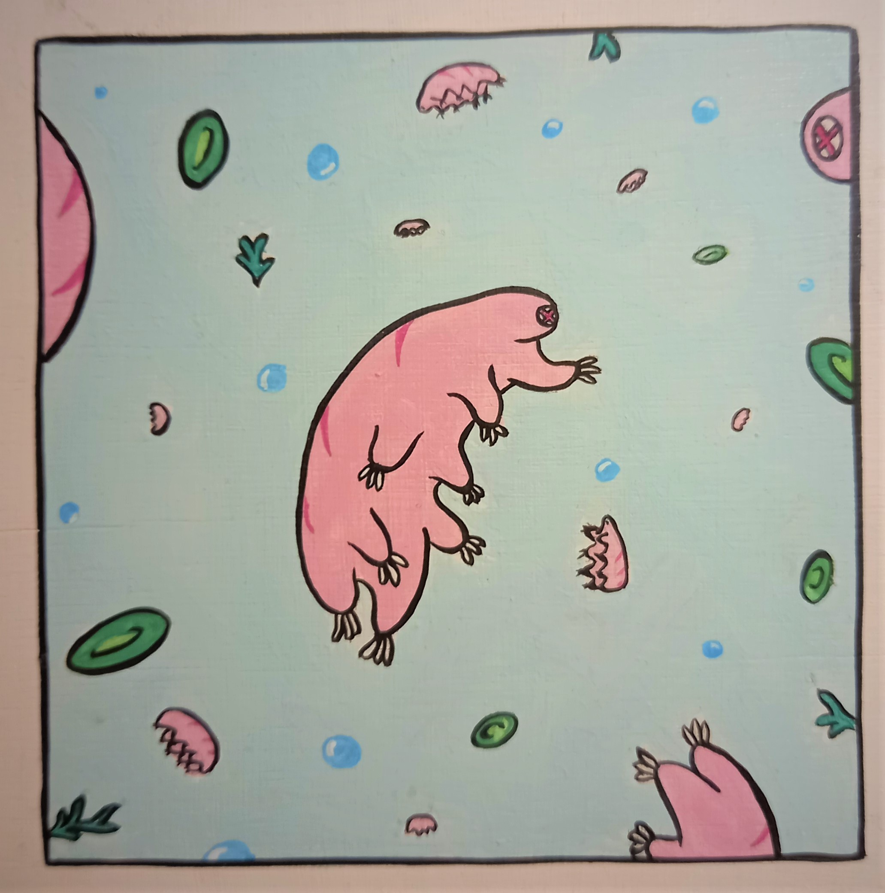

# TARDIGRADE OF MANA

## A top-down mobile action adventure game with a cartoon aesthetic and a unique mechanic

The dominant mechanic for interacting with other agents in video games is through dealing and receiving damage. I'd love to see if this can be inverted, essentially making the 'healer' class character the main player, but still keep lots of familiar game language and design.

Gameplay:
- Top-down action adventure with timing puzzles
- Small levels in big map
- Player moves with on-screen joystick
- Player health and magic is combined as 'mana'
- Give mana to objects/enemies/NPCs by holding on them to transfer. No projectiles
- When enemies receive enough mana, they stop being enemies and emit mana into the area
- Mana receivers have various mana requirements and mana transfer speeds
- If the player runs out of mana (by giving it all or being hit by enemies and hazards), they die
- Mana slowly recovers
- Mana recovers quickly in concentration zones and with pickups
- Can find new abilities (multiple mana transfer targets, emit radial mana wave)
- Player can upgrade their max mana by finding temples


Story:
- Starts with the main player drained of mana by an entity that leaves, and has to recover
- Finds other tiny critters and pondlife that need recovery too. First one joins as a guide
- Finds enemies that will give mana back when recovered/ converted
- Finds some enemies that will never have enough and will always drain. Those ones have to be cut off from the area/village
- Metaphor for how human relationships need to be generous and reciprocal and respectful, told through events and dialogue
- Converts hub area to prosperous and living

Art:
- Microscopic petri-dish scale
- 2D characters, environments, props and effects
- Digitally hand drawn combination of Adventure Time/ Heironomous Bosch/ Ernst Haeckel
- Based on this painting I made:



- Soundtrack that moves between ambient nature/acoustic (Natureboy Flako, Mort Garson) and chiptube/futurebass

## User Stories

```
As a player
so I can have a layered experience
I want the events and mechanics to be metaphors for relationships
```

```
As a player
so I can experience a twist of a popular genre
I want to be able to win by healing enemies
```

```
As a player
so I can enjoy looking at the game
I want it to be digitally hand drawn and animated
```
    
```
As a player
so I can feel a sense of discovery and progression
I want a little world to save with upgrades to discover
```

```
As a player
so I can feel excited or calm
I want to hear dynamic music and sound
```

```
As a developer
so I can engage players
I want to create satisfying gameplay
```

```
As a developer
so I can take on a realistic sized project
I want to make a polished demo to attract funding
```

```
As a developer
so I can make it available to many people
I want to build it for multiple platforms
```

## Tech stack
- Unity
- VS Code
- Github
- Krita